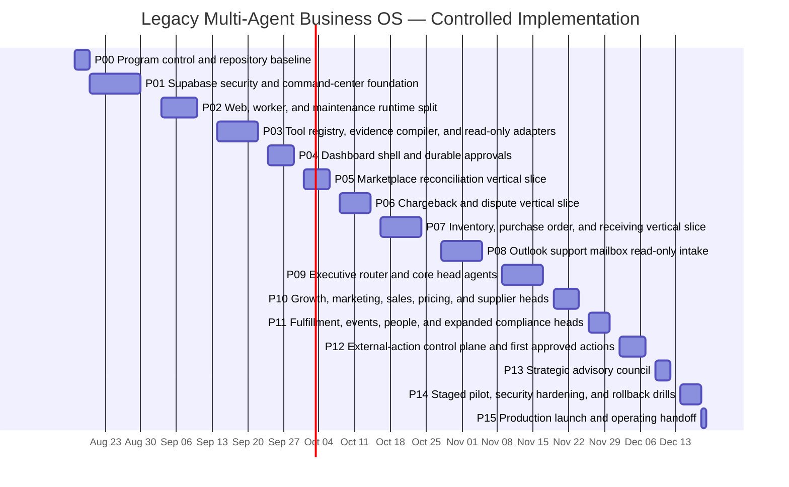

# Legacy Wine & Liquor Multi-Agent Business Operating System
# Live Scheduled Build Implementation Plan

**Repository:** `Jmoney1214/legacy-ops-agent`  
**Operational command center:** Supabase  
**Runtime:** Render web, worker, and maintenance services  
**Agent runtime:** OpenAI Agents SDK  
**Mail:** Microsoft Graph for `support@legacywineandliquor.com` and restricted owner evidence from `info@legacywineandliquor.com`  
**Source-system authorities:** Lightspeed, marketplaces, processors, shipping systems, and approved policy registries  
**Program start:** 2026-08-16  
**Target limited-production launch:** 2026-12-18  
**Planning basis:** 90 implementation weekdays from the live reforecast, one primary implementation stream, no weekend work assumed, and no allowance for external credential or administrator delays.

> Live reforecast issued 2026-08-16 after GitHub implementation began. Dates are control targets, not permission to skip a gate. A phase advances only when its evidence is green.

## Program architecture

```text
Owner / Final Authority
          |
          v
Supabase Command Center
          |
          v
Chief of Staff / Deterministic Router
          |
          +------------------------------+
          |                              |
          v                              v
Functional Head Agents           Strategic Advisory Council
          |                              |
          v                              v
Specialized Workflows             Read-only strategic opinions
          |
          v
Typed, least-privilege tools
          |
          v
Lightspeed / Microsoft Graph / Marketplaces /
Payments / Shipping / Marketing / Events
```

GitHub stores code, migrations, agent artifacts, tests, evaluations, reviews, and release evidence. It is not the runtime command center. Supabase stores live task state, evidence, approvals, runs, queues, audit, verified-memory proposals, and outcomes.

## Non-negotiable program rules

1. **One active implementation phase at a time.**
2. **One short-lived phase branch and one PR per phase.**
3. **Never push directly to `main`.**
4. **Never push a known-broken checkpoint.**
5. **Run debugging and the complete required pre-push gate before the first push and after every review fix.**
6. **Do not merge with a failing, pending, skipped, or unresolved applicable gate.**
7. **All remote Supabase changes must originate from versioned migrations.**
8. **Deterministic code owns money, dates, matching, authorization, idempotency, state transitions, policy, and side effects.**
9. **Agents analyze, classify, recommend, explain, and draft; they do not self-approve or silently execute material actions.**
10. **No phase is complete until post-merge `main` CI and every applicable deployed verification pass; an inapplicable gate requires a factual recorded rationale.**
11. **Do not start the next phase while the current phase has an unresolved blocker or incomplete closeout.**
12. **Scope growth belongs in a new issue or later phase, not the active PR.**

## Master schedule

| Phase | Scope | Start | Target finish | Workdays | Branch | Risk | Independent reviews |
|---|---|---:|---:|---:|---|---|---:|
| P00 | Program control and repository baseline | 2026-08-17 | 2026-08-19 | 3 | `phase/00-program-control` | STANDARD | 1 |
| P01 | Supabase security and command-center foundation | 2026-08-20 | 2026-09-02 | 10 | `phase/01-supabase-command-center` | HIGH | 2 |
| P02 | Web, worker, and maintenance runtime split | 2026-09-03 | 2026-09-11 | 7 | `phase/02-runtime-split` | STANDARD | 1 |
| P03 | Tool registry, evidence compiler, and read-only adapters | 2026-09-14 | 2026-09-23 | 8 | `phase/03-tools-evidence` | STANDARD | 1 |
| P04 | Dashboard shell and durable approvals | 2026-09-24 | 2026-09-30 | 5 | `phase/04-dashboard-approvals` | HIGH | 2 |
| P05 | Marketplace reconciliation vertical slice | 2026-10-01 | 2026-10-07 | 5 | `phase/05-marketplace-reconciliation` | STANDARD | 1 |
| P06 | Chargeback and dispute vertical slice | 2026-10-08 | 2026-10-15 | 6 | `phase/06-chargebacks` | HIGH | 2 |
| P07 | Inventory, purchase order, and receiving vertical slice | 2026-10-16 | 2026-10-27 | 8 | `phase/07-inventory-po-receiving` | HIGH | 2 |
| P08 | Outlook support mailbox read-only intake | 2026-10-28 | 2026-11-06 | 8 | `phase/08-outlook-read` | HIGH | 2 |
| P09 | Executive router and core head agents | 2026-11-09 | 2026-11-18 | 8 | `phase/09-core-head-agents` | STANDARD | 1 |
| P10 | Growth, marketing, sales, pricing, and supplier heads | 2026-11-19 | 2026-11-25 | 5 | `phase/10-commercial-heads` | STANDARD | 1 |
| P11 | Fulfillment, events, people, and expanded compliance heads | 2026-11-26 | 2026-12-01 | 4 | `phase/11-support-heads` | HIGH | 2 |
| P12 | External-action control plane and first approved actions | 2026-12-02 | 2026-12-08 | 5 | `phase/12-controlled-actions` | CRITICAL | 2 |
| P13 | Strategic advisory council | 2026-12-09 | 2026-12-11 | 3 | `phase/13-strategic-council` | STANDARD | 1 |
| P14 | Staged pilot, security hardening, and rollback drills | 2026-12-14 | 2026-12-17 | 4 | `phase/14-pilot-hardening` | CRITICAL | 2 |
| P15 | Production launch and operating handoff | 2026-12-18 | 2026-12-18 | 1 | `phase/15-production-handoff` | CRITICAL | 2 |

## Milestones

| Target date | Business/technical milestone |
|---|---|
| 2026-09-02 | Secure Supabase command-center foundation |
| 2026-10-07 | Weekly Uber Eats/DoorDash versus Lightspeed audit operating in staging |
| 2026-10-15 | Chargeback task/evidence/approval workflow operating in dry-run mode |
| 2026-10-27 | Inventory, draft PO, receiving, and finance reconciliation operating in staging |
| 2026-11-06 | `support@` read-only ingestion, classification, tasking, and drafts operating in staging |
| 2026-11-18 | Core executive router and head agents operating read-only |
| 2026-12-08 | First approval-bound support/vendor email actions available under allowlist |
| 2026-12-17 | Pilot, rollback, restore, and security go/no-go complete |
| 2026-12-18 | Limited production launch and operating handoff |

## Gantt



## Phase progression

```text
PLANNED -> READY -> IN_PROGRESS -> LOCAL_VERIFY -> PRE_PUSH_REVIEW
-> PR_DRAFT -> CI_REVIEW -> STAGING_VERIFY -> READY_TO_MERGE
-> POST_MERGE_VERIFY -> COMPLETE
```

Blocking states are explicit: clarification, credential, external administration, test failure, security, review, staging, or cancellation.

## Risk and review classes

| Class | Typical changes | Minimum review |
|---|---|---|
| STANDARD | Documentation, read-only service code, non-sensitive agent instructions | Automated review when configured plus 1 independent human approval |
| HIGH | Supabase migrations/RLS, authentication, mailbox permissions, PII, inventory/financial controls, compliance logic | Automated review plus 2 independent human reviews |
| CRITICAL | External side effects, production permissions, payments/refunds, regulated actions, production launch | Automated and security review, 2 independent human approvals, and explicit owner release approval |

## Merge authorization

A PR may be squash-merged only when all applicable checks, reviews, review-thread resolution, staging verification or a factual `not_applicable` rationale, rollback confirmation, and recorded merge authorization are green. A `not_applicable` record is not a bypass for an applicable check. HIGH production releases and every CRITICAL phase also require explicit owner release approval.

## No-overcoding rule

Split or defer work when estimated scope grows by more than 20%, a new integration or permission is discovered, unrelated schemas are affected, the PR is no longer reviewable, a clarification gate is unresolved, or existing deterministic logic would be rewritten rather than wrapped.

## Program-level Definition of Done

The program is complete only when Supabase is the secure command center; web, worker, and maintenance processes are separated; deterministic services remain authoritative; tools and evidence are typed and least-privilege; head agents are evaluated and read-only by default; Outlook intake is scoped; only approved actions are enabled; rollback and restore drills pass; and the owner approves limited production rollout.
